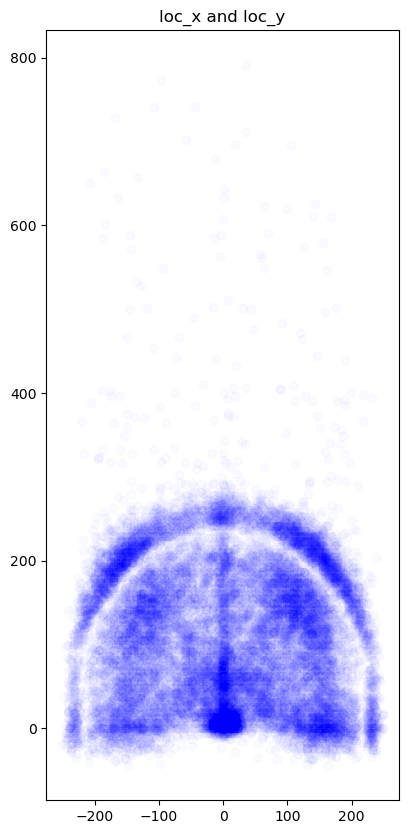
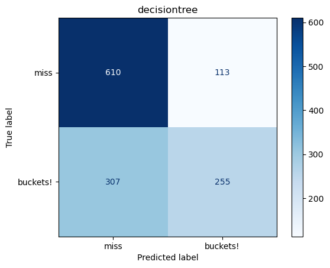
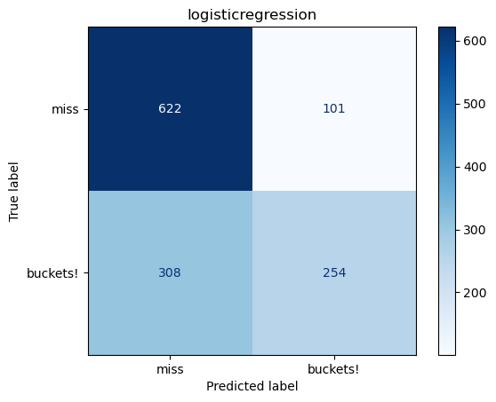

## Kobe shots Summmary ##

I worked as a team with 2 other people in a 1 day hackathon to develop a basketball classification model, this repo contains my individual notebooks, with help and conclusions from my two teammates.

File structure
* zip folder containg the zipped data
* data folder with images and data
* notebook folder with notebooks
    * Kobe data cleaning notebook
    * Elliott's model notebook with LogR and DTC

## Project statement ##
* Team: Elliott, Nikki, Alan (Data Mambas)
* Dataset: Kobe Bryant Shot Selection
* Problem Statement: Using information on every shot Kobe Bryant took during his career, we will develop classification models that will predict whether it was missed or made shot. The baseline accuracy of guessing all misses is 55%

## Graphics ##

### this is the combination of the x and y with a little help from transparency, that clearly shows the 3 point line and where ths shots are concentrated, directly in front and close to the rim being the best. ###

### this is the confusion matrix of a decesion tree clasifier that's about 62% accurate with only distance ###

### this is the confusion matrix of a logistic regression that's about 68 on the train % accurate ###

### best model ###

For the log loss kaggle submission my decision tree clasifier only on distance scored the best with a 13 point log loss off a baseline of 18.

For the accuracy score Alan's GridSearch Linear SVC classifier was the best of all of ours with 69%, with hypertuning max Params = 8000 and C = 0.005

## Conclusions ## 
 * Distance is an important indicator of shot maiking as including just it and pos X/y gives 60% of the accuracy, but there's also a lot of noise in the data that with some more expert knowledge of basketball could probably be pulled out but we do not have that expert knowledge.
 * Alan and nikki with his expert knowledge hot encoded matchups which Elliott did not, which made the slight difference in accuracy score, given that more expert knowledge could pull a lot more out of the data set.